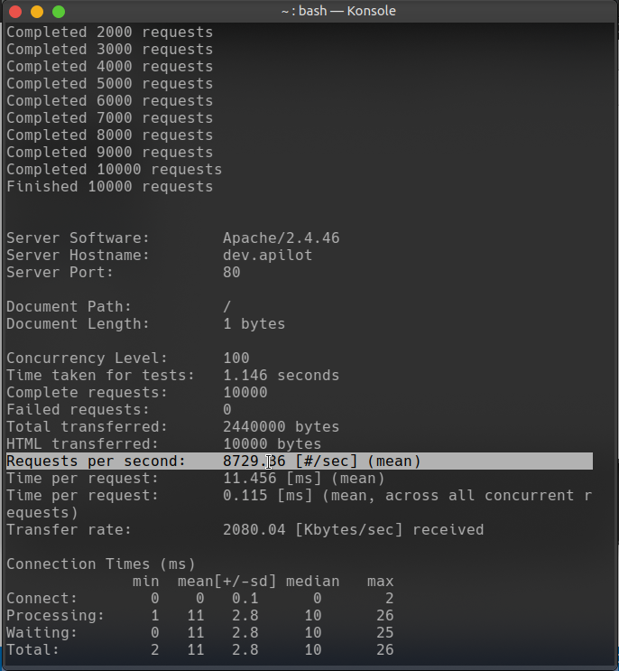

# Apilot
Fast automatic files based router with Caching routes



### WARNING
Design api carefully

## Installation

### Using Composer
```
    composer require nabeelalihashmi/apilot-engine
```
### Manual
Just download the `Apilot.php` file, include in your project. Configure `.htacess`.

```
<?php
    $apilot = new Apilot($handlers_path, $cache_path, $optional_server_basepath);
    $apiot->on404(function() {
        ...
    });
    $apilot->takeoff();
?>

```

### .htaccess files

- Copy extras/root.htaccess in root folder and rename it to .htaccess.
- Copy extras/public.htaccess in public folder and rename it to .htaccess.
## Routes
Make a folder for handlers. Each file in that cockpit folder corresponds to a route.

e.g.

```
cockpit/
    index.php -> /
    about.php -> /about
    contact.php -> contact
    ...

```

Each file must have at least one handler method. The name of the method must be `handle`.

e.g.

```
    function GET() {

    }

    function POST() {

    }

    function PUT() {

    }
    
```

## Dynamic routes

To make a route accept dynamic value, use `:` in the route.

e.g.

```
    File: cockpit/users/:id/edit.php
    URI: /users/:id/edit

    function GET($id) {
        ...
    }
s
    File: cockpit/users/:id/:action.php
    URI: /users/:id/:action

    function GET($id, $action) {
        ...
    }

```

## Optional Parameters

To make a route optional, make the parameter optional with `?`.

```
    File: cockpit/list/:page?.php
    URI: /list/:page?

    function GET($page = 1) {
        ...
    }

```
## Rules

* Optional Routes must place at end
```
hello/:who? Good
hello/:who?/level2 Bad
hello/:who?/level2 Bad

```

## Middleware

You can use middleware to do something before and after the route. You can use `before` and `after` appended to handler method name. before middleware must return true to continue.

```
function GET() {

}

function before_GET() {
    return true;
}

function after_GET() {

}
```

## Route Not Found

Apilot will call the `on404` function if the route is not found. You can use this function to redirect to 404 page or do something else.

usage:

```
$apilot->on404(function() {
    ...
});
```